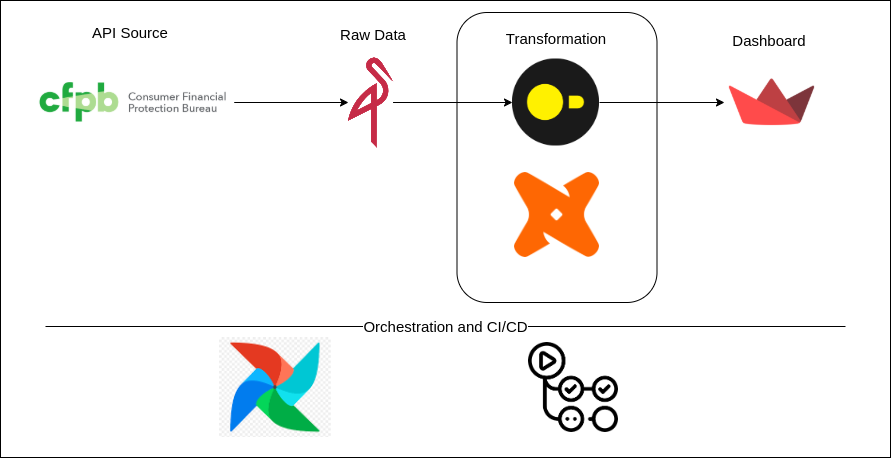

# CFPB Local Data Warehouse

This project implements a ELT pipeline that retrieves consumer complaint data from the CFPB API, this data then is stored in a two-tier local data warehouse (MinIO for raw data, DuckDB for transformed data). dbt is used to transform data into analytics-ready models, and serves interactive dashboards



* **Python Package Manager**: [uv](https://docs.astral.sh/uv/)
* **Data Ingestion**: [Request](https://requests.readthedocs.io/en/latest/) for API interaction, Pure Python for ingestion logic and [PyArrow](https://arrow.apache.org/docs/python/index.html) for fast data interchange
* **Raw Data Storage**: [MinIO](https://www.min.io/)
* **Transformation**: [dbt-core](https://www.getdbt.com/) & [dbt-colibri](https://www.colibri-data.com/)
* **OLAP Database**: [DuckDB](https://duckdb.org/)
* **Orchestration**: [Airflow](https://airflow.apache.org/)
* **BI Tool**: [Streamlit](https://streamlit.io/)

## How to run the pipeline

### 1. Set up

- Install Python dependencies: `uv sync --extra dev`
- Create a `.env` file with the following content

    ```bash
    MINIO_ROOT_USER="your_minio_root_user"
    MINIO_ROOT_PASSWORD="your_minio_root_password"
    export AIRFLOW_USERNAME="your_airflow_username"
    export AIRFLOW_PASSWORD="your_airflow_password"
    ```

### 2. Spin up infrastructure

- MinIO: `docker compose up -d`
- Airflow: `./start_airflow`

### 3. Run Airflow DAG

See [docs/run_dag_guide.md](docs/run_dag_guide.md) for more details

### 4. Testing

```bash
# Run Python tests
`uv run pytest tests/`
```

## Access UIs

- MinIO Console: http://localhost:9001
- Airflow Web UI: http://localhost:8081
- Streamlit: http://localhost:8081