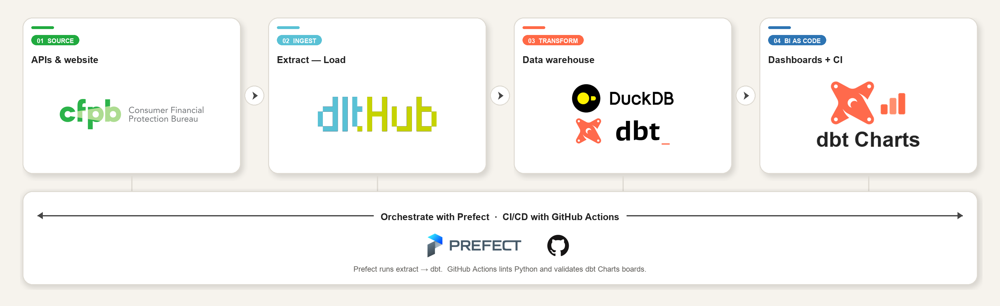
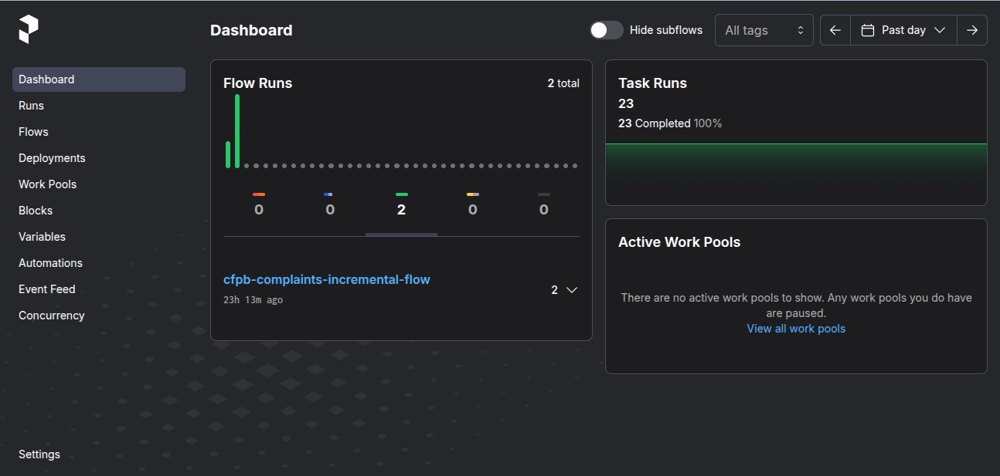
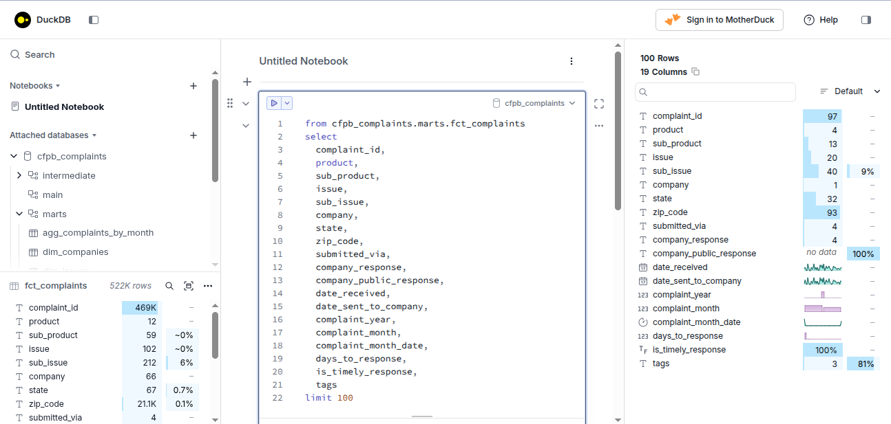
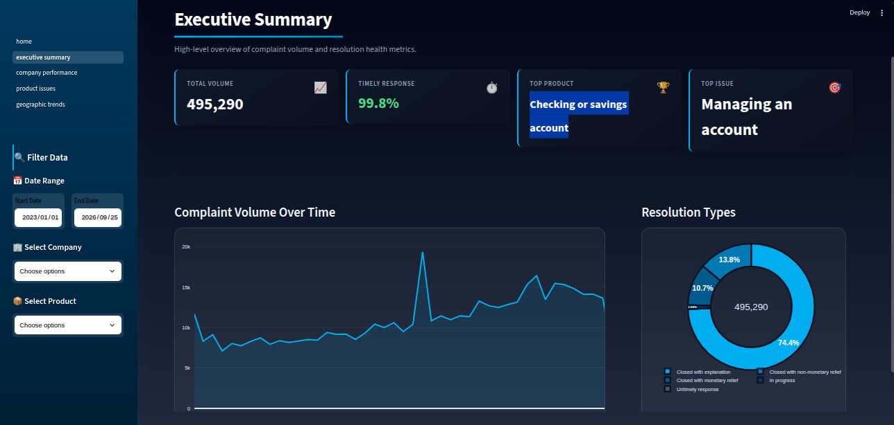
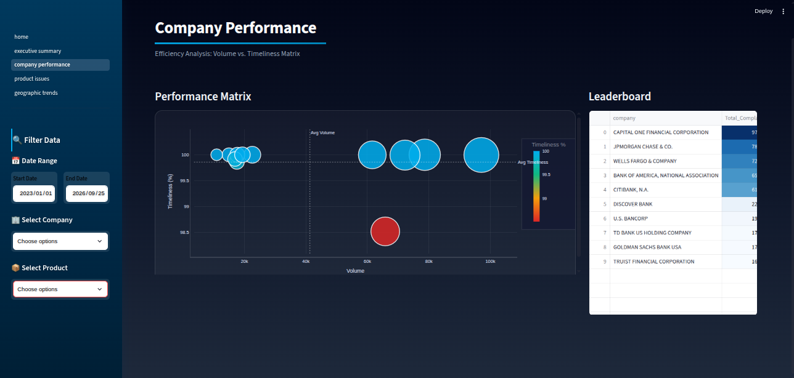
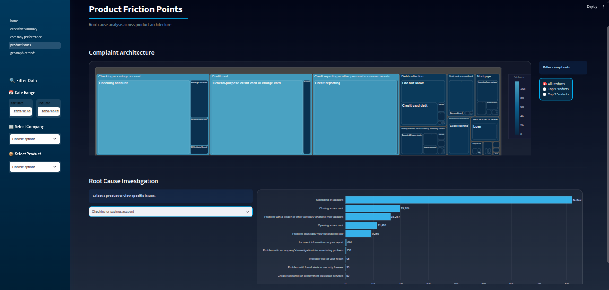
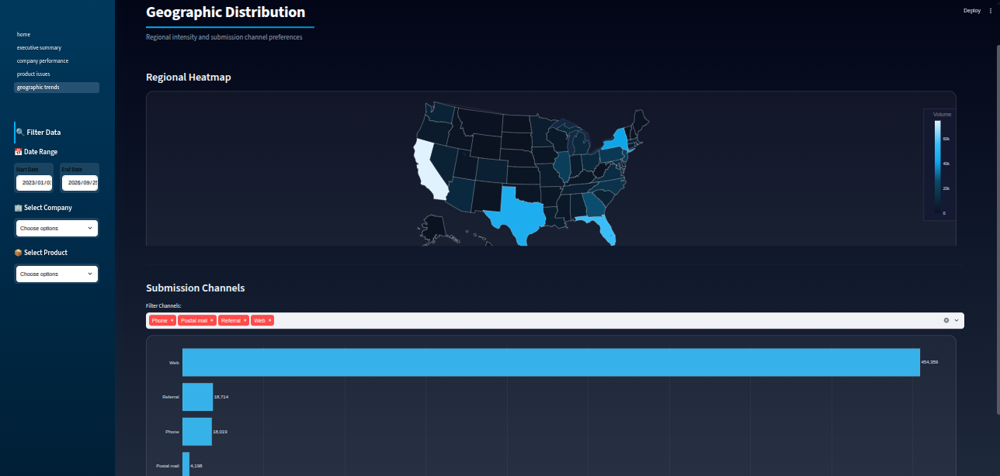

# CFPB Local Data Warehouse

A local-first data warehouse pipeline that extracts CFPB consumer complaint data, transforms it with dbt into analytics-ready models, and serves interactive dashboards—all running on your laptop with zero cloud dependencies.

- **Package Manager**: [uv](https://docs.astral.sh/uv/) (Python)
- **Ingestion**: [dlt](docs/1_ingestion.md) (API -> Parquet staging -> DuckDB)
- **Staging Format**: [Parquet](docs/2_file_format.md) (via [PyArrow](docs/2_file_format.md)) in `landing/`
- **OLAP Database**: [DuckDB](docs/3_data_warehouse.md)
- **Transformation & Documentation**: [dbt](docs/4_transformation.md) & [dbt-colibri](docs/4_transformation.md)
- **Orchestration**: [Prefect](docs/5_orchestration.md)
- **BI Tool**: [Streamlit](docs/6_dashboard.md)
- **CI/CD**: [Github Action](docs/7_cicd.md)



## 1. Quick Start

### 1.1. Setup

```bash
# Install dependencies
uv sync

# Install dev dependencies (for testing)
uv sync --extra dev
```

### 1.2. Configuration

Edit [src/cfg/config.py](src/cfg/config.py) to configure companies and start date:

```python
START_DATE = "2023-01-01"
COMPANIES = ["jpmorgan", "bank of america"]
```

### 1.3. Run the Pipeline

```bash
# Run incremental pipeline (first run loads from START_DATE to today)
uv run python run_prefect_flow.py

# Reset state to reload from START_DATE
uv run python run_prefect_flow.py --reset-state
```

### 1.4. Backfill Landing Area

Use the backfill script to populate historical data:

```bash
# Backfill a date range
uv run python run_backfill.py --start 2026-01-01 --end 2026-02-25

# Backfill a single day
uv run python run_backfill.py --start 2026-01-15 --end 2026-01-15

# Backfill last 7 days
uv run python run_backfill.py --days 7
```

Each daily directory (`_backfill` suffix for backfill pipelines) contains N * M parquet files (N is the numbers of configured companies, M is data time range for that company). Empty parquet files are created for days with no complaints to maintain a consistent structure.

```bash
landing/
└── cfpb_complaints
    └── 2026_09_28              # incremental pipeline
        ├── bank_of_america_2023-01-01_2026-09-28.parquet
        ├── capital_one_2023-01-01_2026-09-28.parquet
        ...
    └── 2026_09_30_backfill     # backfill pipeline
        ├── bank_of_america_2026-09-01_2026-09-01.parquet
        ├── bank_of_america_2026-09-01_2026-09-03.parquet
        ├── capital_one_2026-09-01_2026-09-01.parquet
        ├── capital_one_2026-09-01_2026-09-03.parquet
        ...
```

### 1.5. Access Prefect UI (Optional)

```bash
# Start Prefect server
./start_prefect_server.sh

# Access UI at http://127.0.0.1:4200
```



### 1.6. Access DuckDB UI

Launch the DuckDB UI:

```bash
# run workflow first
duckdb -ui database/cfpb_complaints.duckdb

# Access UI at http://localhost:4213
```



### 1.7. Access Streamlit Dashboards

```bash
uv run streamlit run app/dashboard/home.py
```

The dashboard will open automatically in your default browser at http://localhost:8501

### 1.8. Generate dbt Lineage Reports with Colibri

Generate interactive data lineage reports to visualize how data flows through your dbt models:

```bash
# Navigate to the dbt project directory
cd cfpb_complaints

# Compile models and generate dbt documentation
dbt compile && dbt docs generate

# Generate lineage report
colibri generate
```

Open `cfpb_complaints/dist/index.html` in your browser to explore the interactive lineage visualization showing model dependencies, data flow, and column-level lineage.

## 2. Testing

```bash
# Run python tests
uv run pytest tests/
```
```bash
# Run dbt tests
cd cfpb_complaints
dbt test
```

## 3. Dashboards

**Executive Summary**:



**Company Performance**:



**Product Friction Points**:



**Geographic Trends**:

