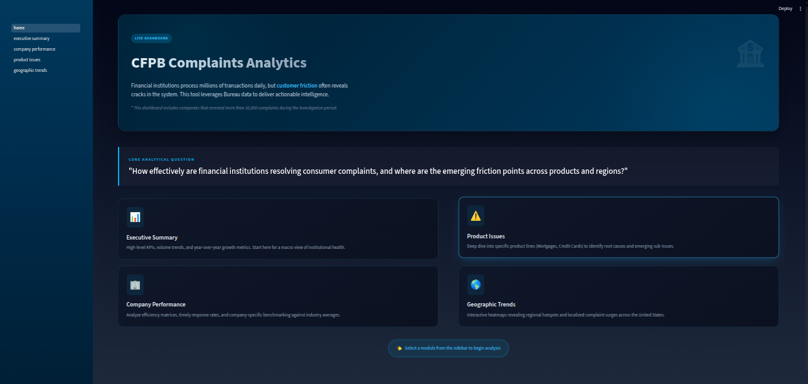

# Analytics Dashboard (Streamlit)

A local Streamlit dashboard for exploring Consumer Financial Protection Bureau (CFPB) complaint data: executive summary, company performance, product friction points, geographic trends.

## Dashboard Overview

This dashboard serves as the front-end layer for the CFPB ELT pipeline. It is designed to help analysts and stakeholders answer key questions:
- **Macro Trends**: How is complaint volume changing over time?
- **Company Benchmarking**: Which companies handle complaints most effectively?
- **Root Cause Analysis**: What specific products or issues are causing consumer friction?
- **Geographic Distribution**: Where are complaints originating from?

## Project Structure

```bash
app/
└── dashboard/
    ├── config.py                    # Centralized configuration (colors, fonts, constants)
    ├── chart_factory.py             # Reusable Plotly chart components
    ├── components.py                # Reusable Streamlit UI components
    ├── data_utils.py                # Data transformation utilities
    ├── utils.py                     # Core utilities (DB connection, filters, styling)
    ├── home.py                      # Landing page
    └── pages/
        ├── 1_executive_summary.py   # KPIs and high-level trends
        ├── 2_company_performance.py # Company efficiency benchmarking
        ├── 3_product_issues.py      # Product/issue root cause analysis
        └── 4_geographic_trends.py   # Regional distribution and channels
```

## Architecture Highlights

**Refactored for Maintainability**:

- **DRY Principles**: All chart configurations, UI components, and data transformations are centralized
- **Separation of Concerns**: Each module has a single, clear responsibility
- **Reusable Components**: 10 chart methods, 6 UI components, 6 data transformations
- **Single Point of Change**: Update theme colors, fonts, or chart styles in one place

**Key Modules**:
- `config.py` - Theme colors, font settings, color scales
- `chart_factory.py` - Factory methods for consistent Plotly charts
- `components.py` - Reusable KPI cards, filters, containers
- `data_utils.py` - Common pandas operations (aggregations, filtering)
- `utils.py` - Database loading, sidebar filters, global styling

## Page Guide

Below is a breakdown of each page in the dashboard.

### 1. Home/Landing Page (`home.py`)

The central navigation hub that introduces the available analysis modules.
- **Function**: Routes users to specific analytical co*ntexts
- **Key Elements**: Hero section with project overview, core analytical question, and navigation cards for each module

**Features**:
- Live dashboard badge with gradient styling
- Animated navigation cards with hover effects
- Clear call-to-action for sidebar navigation



### 2. Executive Summary (`1_executive_summary.py`)

A high-level view for decision-makers to monitor overall system health.

**Key Metrics (KPIs)**:
- **Total Volume**: Overall complaint count with thousands separator
- **Timely Response**: Percentage with color-coded indicator (green > 90%, yellow <= 90%)
- **Top Product**: Most complained-about product with adaptive text sizing
- **Top Issue**: Most common issue with adaptive text sizing

**Visualizations**:
- **Volume Trends**: Time-series area chart showing complaint spikes over time with monthly resampling
- **Resolution Types**: Donut chart showing company response distribution (e.g., "Closed with explanation")

**Technical Details**:
- Uses `ChartFactory.create_area_chart()` for trend visualization
- Uses `ChartFactory.create_donut_chart()` with center text annotation
- Responsive 2:1 column layout for optimal space utilization


### 3. Company Performance (`2_company_performance.py`)

A benchmarking tool to compare financial institutions against one another.

**Key Components**:

- **Performance Matrix**: Scatter plot analyzing Volume vs. Timeliness relationship

    - X-axis: Total complaint volume
    - Y-axis: Timely response rate (%)
    - Bubble size: Proportional to complaint volume
    - Color: Gradient from red (low timeliness) to blue (high timeliness)
    - Reference lines: Average volume and average timeliness for quadrant analysis

- **Leaderboard**: Top 10 companies ranked by complaint volume

    - Gradient coloring: Green (high timeliness), Red (low timeliness)
    - Blue gradient for volume intensity

**Insights Enabled**:
- Identify high-volume efficient companies (top-right quadrant)
- Flag overwhelmed institutions (high volume, low timeliness)
- Benchmark against industry averages

**Technical Details**:
- Uses `DataTransformations.calculate_company_stats()` for metrics
- Uses `ChartFactory.create_scatter_chart()` with reference lines
- Styled dataframe with dual gradient coloring (RdYlGn + Blues)


### 4. Product Friction Points (`3_product_issues.py`)

A deep-dive tool for Product Managers to identify root causes.

**Key Features**:

- **Complaint Architecture (Treemap)**: Hierarchical visualization of Product -> Sub-Product

    - Color intensity: Complaint volume
    - Filterable: All Products / Top 5 / Top 3
    - Rounded corners with subtle borders

- **Root Cause Investigation**: Drill-down analysis

    - Product selector with info box guidance
    - Top 10 issues for selected product
    - Horizontal bar chart sorted by frequency

**Use Cases**:
- Prioritize product improvements based on complaint volume
- Identify specific pain points within product categories
- Compare issue distribution across products

**Technical Details**:
- Uses `DataTransformations.prepare_treemap_data()` with smart filtering
- Uses `ChartFactory.create_treemap()` with monochrome blue scale
- Uses `ChartFactory.create_horizontal_bar()` for issue ranking


### 5. Geographic Trends (`4_geographic_trends.py`)

A regional analysis of consumer sentiment and submission channels.

**Key Visualizations**:

- **Regional Heatmap**: USA choropleth map

    - Color intensity: Complaint density by state
    - Deep blue gradient for financial analytics aesthetic
    - Hover tooltips with state name and complaint count

- **Submission Channels**: Horizontal bar chart

    - Breakdown: Web, Phone, Referral, Postal mail, Fax, Email
    - Multi-select filter for channel comparison
    - Sorted by volume for easy comparison

**Insights Enabled**:
- Identify regional hotspots requiring targeted interventions
- Understand channel preferences by region
- Optimize customer service resources by geography

**Technical Details**:
- Uses `ChartFactory.create_choropleth()` with USA scope
- Uses `DataTransformations.value_counts_df()` for aggregations
- Dynamic filtering with Streamlit multiselect


## How to Run

**Prerequisite**: This guide assumes you have already run the data extraction pipeline and the `database/cfpb_complaints.duckdb` exists.

### Step 1: Install dependencies

```bash
uv sync
```

This will install all required packages including:
- `streamlit` - Dashboard framework
- `plotly` - Interactive visualizations
- `duckdb` - Database connectivity
- `pandas` - Data manipulation

### Step 2: Running the dashboard

```bash
uv run streamlit run app/dashboard/home.py
```

The dashboard will open automatically in your default browser at http://localhost:8501

### Step 3: Navigate the dashboard

1. **Start at Home** - Review the overview and select a module/page
2. **Use Sidebar Filters** - Available on all pages:

    - 📅 Date Range: Filter by complaint submission date
    - 🏢 Company: Multi-select from top 50 companies
    - 📦 Product: Multi-select from all product categories

3. **Explore Visualizations** - Hover for details, click filters for drill-down