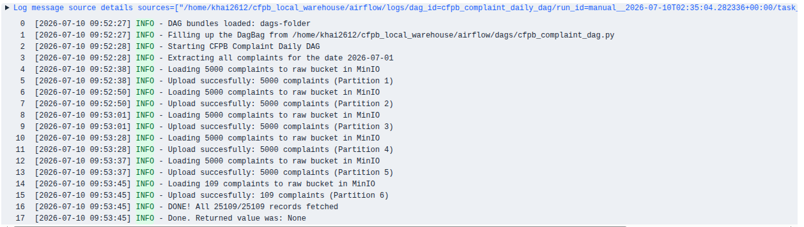
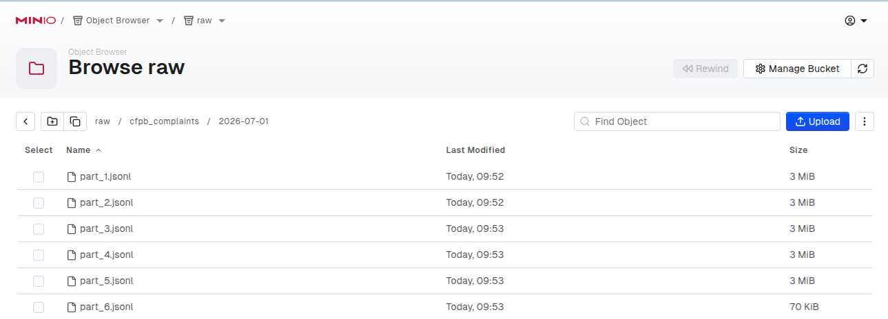
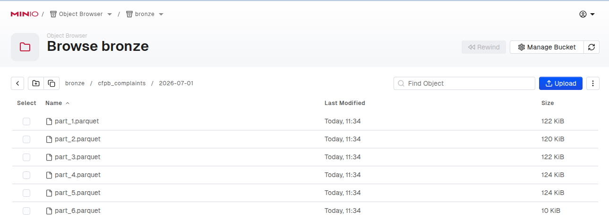
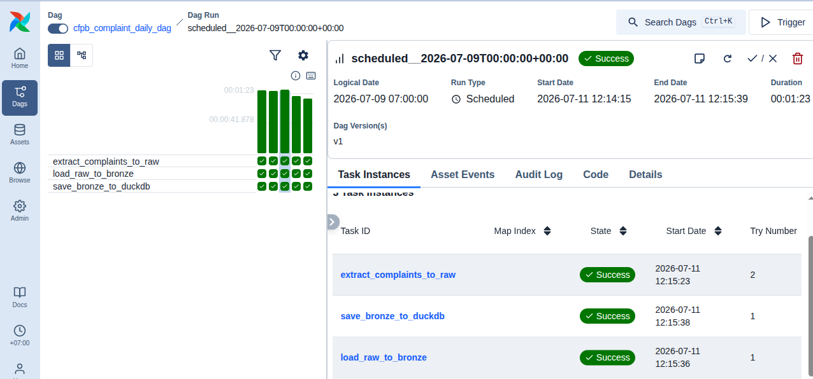
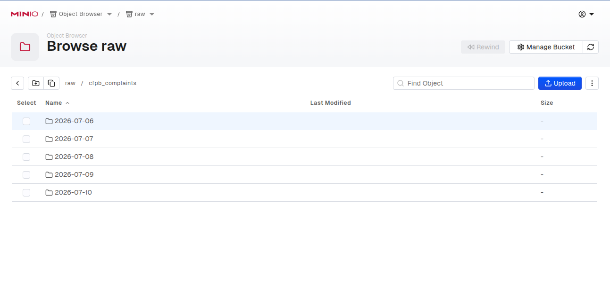
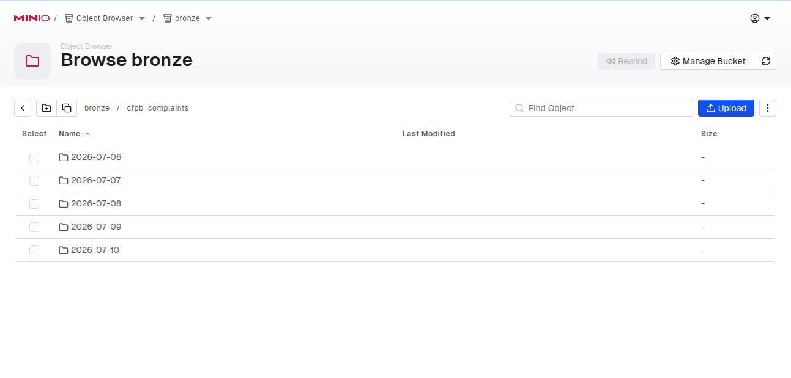
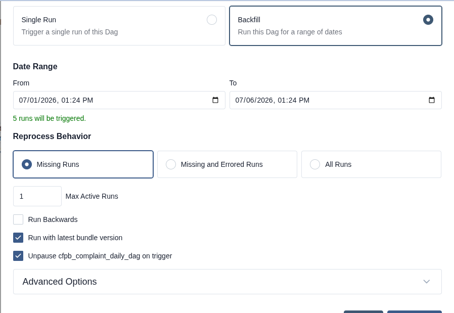
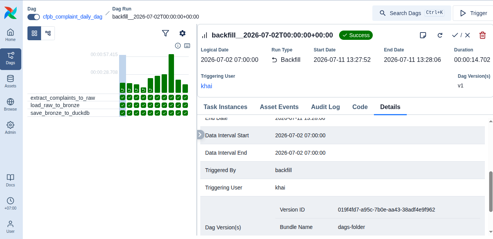

# How to run project

Before running the DAG, ensure that MinIO (`docker compose up -d`) and Airflow (`./start_airflow.sh`) are spun up

### Run pipeline (no catchup)

**When to use**: you want to run an Airflow DAG for today (to process data from the previous day)

In Airflow UI, unpause the `cfpb_complaint_daily_dag` DAG, Airflow will automatically create a DAG run for today using data from the previous day. For example, running an Airflow DAG to fetch data for July 1, 2026

- Logs in `extract_complaints_to_raw` task

    

- Extract-to-raw task

    

- Raw-to-bronze task

    

### Run catchup pipeline

**When to use**: you want to run an Airflow DAG for all days from the `start_date` up to today

In Airflow, if `catchup=True` is set in the Dag, the scheduler will kick off a Dag Run for any data interval that has not been run since the last data interval (or has been cleared). Catchup is very useful when a new DAG is run for the first time

For example, assuming today is July 11, 2026 with `start_date=datetime(2026, 7, 7)`, running a catch-up pipeline would look like this
- Airflow UI

    

- `raw` layer

    

- `bronze` layer

    

- DuckDB layer: run `SELECT COUNT(*) FROM raw.cfpb_complaints;`. You should see total number of records for all five days

    ```bash
    ┌──────────────┐
    │ count_star() │
    │    int64     │
    ├──────────────┤
    │        58514 │
    └──────────────┘
    ```

### Run backfill pipeline

**When to use**: you want to run an Airflow DAG for all historical data within a specific date range

Airflow enables to run a **backfill**, which create runs for past dates of a Dag. You provide a Dag, a start date, and an end date, and Airflow will create runs in the range according to the Dag’s schedule. Note that Backfill does not make sense for Dags that don't have a time-based schedule

- Set up backfill

    
    
- Backfill Airflow UI

    